# **GOMYCODE Assignment Submission – Checkpoint 1**

## **Virtualization, Networking & Web Service Discovery**

### **Student Name:** *Paschal Emechebe*

### **Course:** Cybersecurity Track

### **Checkpoint:** Virtualization, Networking & Web Service Discovery

### **Instructor:** *[Instructor]*

### **Date:** *14/11/2025*

---

# **1. Installing Kali Linux on Vmware workstation pro 17**

Kali Linux was installed on  Vmware workstation pro 17 following the provided guidelines.
After installation:

* System was fully updated (`sudo apt update && sudo apt upgrade`).
* Network connectivity was verified by accessing websites and using ping.

**Screenshots:**
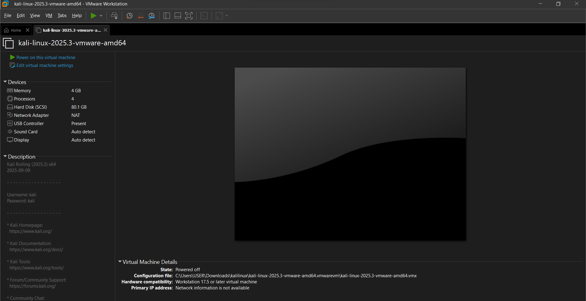


---

# **2. Testing Connectivity – ping 8.8.8.8**

### **Command Used**

```
ping 8.8.8.8
```

### **2.1 What does the ping command do?**

The **ping** command sends **ICMP Echo Request** packets to another device to check:

* If the device is reachable
* Latency (round-trip time)
* Packet loss

### **2.2 What is IP 8.8.8.8?**

`8.8.8.8` is **Google's Public DNS server**.
It’s commonly used for connectivity tests because:

* It is always online
* Globally reachable
* Stable and fast

### **2.3 Objective of running the command**

To confirm:

* Internet connection
* VM network configuration
* Ability to reach external servers


**Screenshots:**
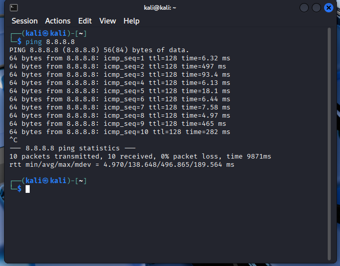


---

# **2.4 Running traceroute 8.8.8.8**

### **Command**

```
traceroute 8.8.8.8
```

### **What does traceroute show?**

Traceroute displays **all routers (hops)** your packets pass through before reaching the destination.

### **How many hops to Google DNS?**

30 hops.

### **What does each line represent?**

Each line represents **one device/router** along the route.
Timeouts (`* * *`) mean that hop refused/blocked ICMP responses but still forwarded traffic.


---

# **3. Identify IP Addresses (Kali & Windows)**

### **Kali Linux Command**

```
ip a
```

### **Windows Command**

```
ipconfig
```

### **Ping Test Between Machines**

* Ping Windows from Kali
* Ping Kali from Windows

### **Can they communicate?**

*Yes they can communicate*


* Firewall allows ICMP


**Screenshots:**
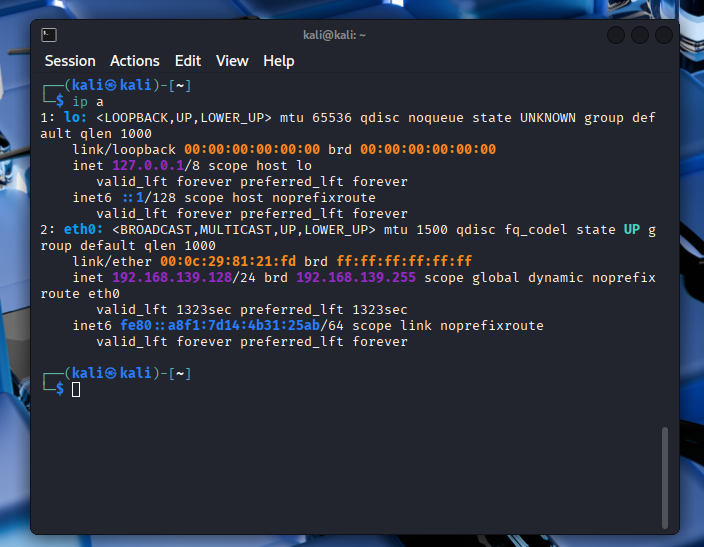

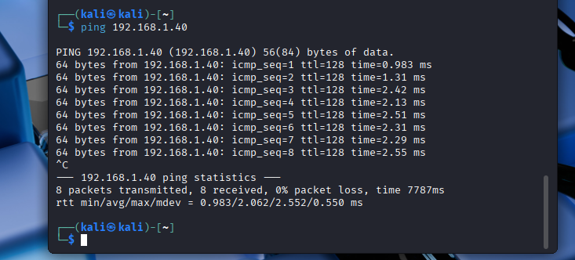
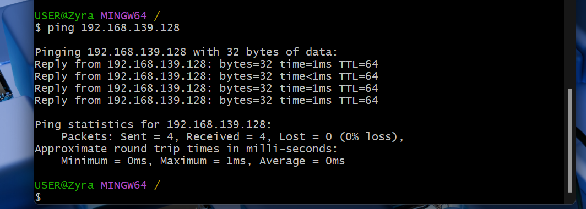

---

# **4. Testing Vmware workstation pro Networking Modes**

Two modes were tested:

## **4.1 NAT Mode**

* VM uses Vmware workstation pro’s virtual NAT router
* VM can access the internet
* Host usually **cannot** ping the VM
* VM often **cannot** reach host’s local address

## **4.2 Bridged Adapter**

* VM connects **directly to the same network** as the host
* Both machines get IPs from the same router
* Ping works **both ways**

### **Which mode allowed communication?**

✔ **Bridged mode** enables full two-way communication
❌ NAT usually does not

### **Explanation**

Bridged mode places the VM on the same network as the host → direct communication.
NAT hides the VM behind a virtual NAT device → no inbound access.

**Screenshots:**

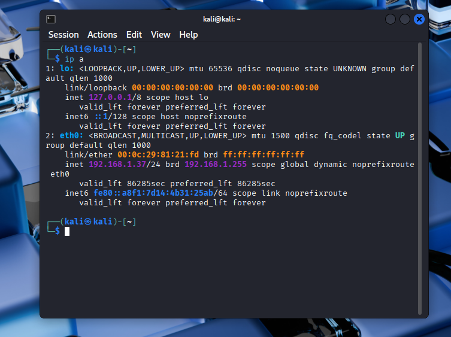

---

# **5. Installing XAMPP on Windows**

XAMPP was downloaded and installed on the Windows host.
Apache module was started successfully from the XAMPP Control Panel.

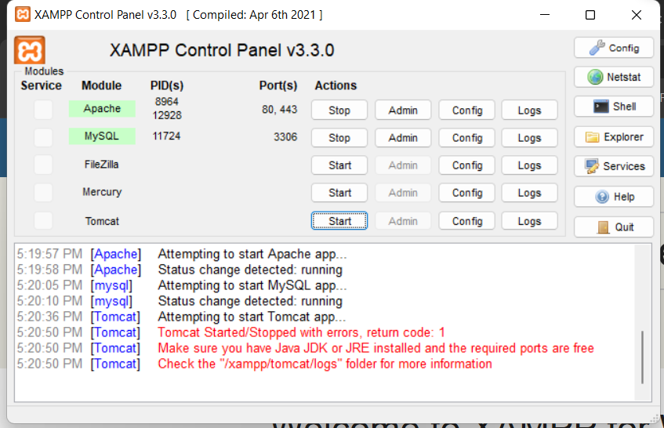


---

# **6. Access the Default XAMPP Web Page**

To access the default web server:

### **Options**

```
http://localhost
http://127.0.0.1
```

### **What IP is used?**

`127.0.0.1` is the **loopback address**, meaning the request is handled by the same computer.

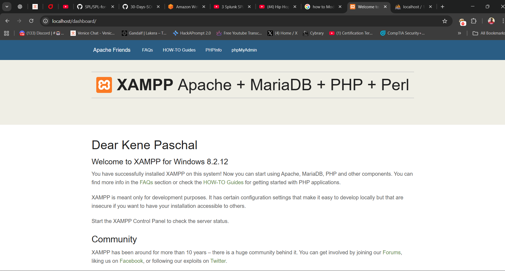

---

# **7. Modifying index.html in htdocs**

Steps:

1. Navigated to:
   `C:\xampp\htdocs\index.html`
2. Added **full name** inside the file.
3. Saved and refreshed the browser.

**Screenshots:**
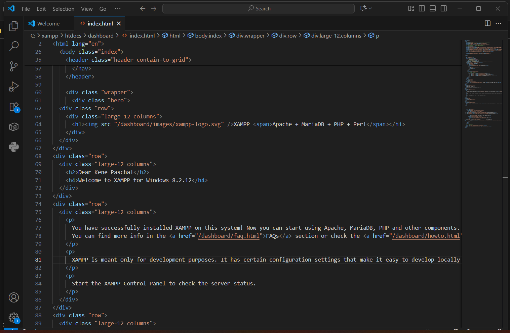


---

# **8. Access XAMPP Web Server from Kali Linux**

### **Test Command**

From Kali browser or terminal:

```
http://192.168.1.40
```

or

```
curl http://192.168.1.40
```

### **Were you able to reach the page?**

*No*

### ** required configuration changes:**

✔ Used **Bridged Adapter** so both systems share the same network
✔ Ensure **Apache is running** in XAMPP
✔ Temporarily disable Windows Firewall, Enable inbound rule to 
✔ Make sure “Listen 0.0.0.0:80” is enabled in Apache config
✔ Test connectivity using ping or curl

### **Explanation**

For Kali to reach XAMPP, both must be on the same network and port 80 must be accessible.

**Screenshot:**
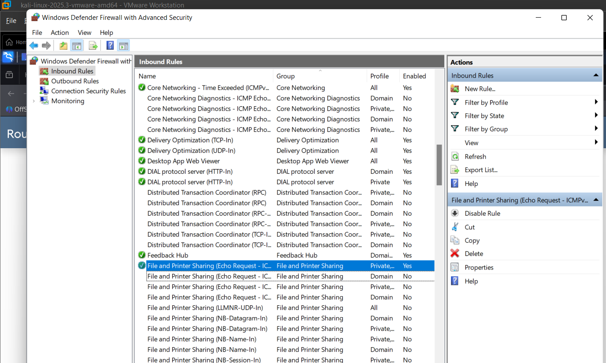
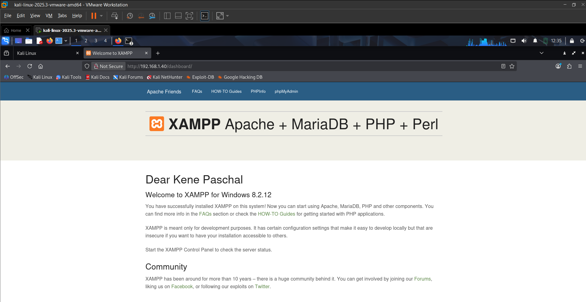

---

# **9. Scanning Windows Host with Nmap**

### **Command**

```
nmap -sV 192.168.1.40
```

### **Questions**

### **1. What open ports are detected?**

* 80/tcp → Apache HTTP
* 443/tcp → HTTPS
* 3306/tcp → MySQL Database
* 3389/tcp → Microsoft Terminal service

### **2. What is the Apache version?**

Example:
`Apache httpd 2.4.58`

### **3. Can you identify the database server?**

Yes —  MariaDB.

`3306/tcp open mysql MySQL 10.4.32-MariaDB`

**Screenshot:**
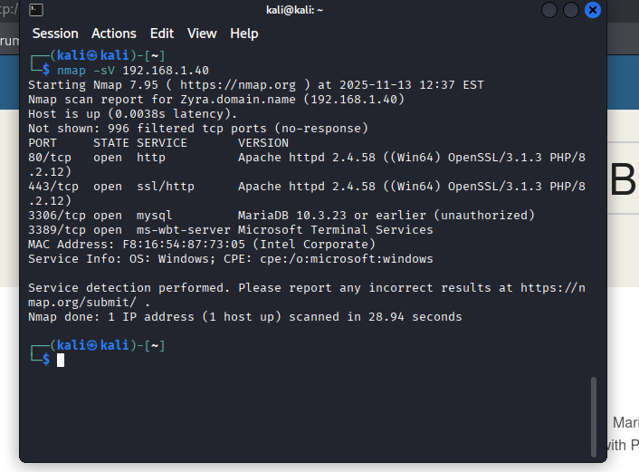

---

# **Conclusion**

In this checkpoint, the following was successfully completed:

* Installed Kali Linux on Vmware
* Tested internet connectivity (ping & traceroute)
* Identified VM and host IPs
* Compared NAT vs Bridged mode
* Installed and tested XAMPP
* Modified web content
* Accessed host web server from Kali
* Performed service discovery using nmap

This confirms understanding of virtualization, networking basics, and service enumeration.

---

