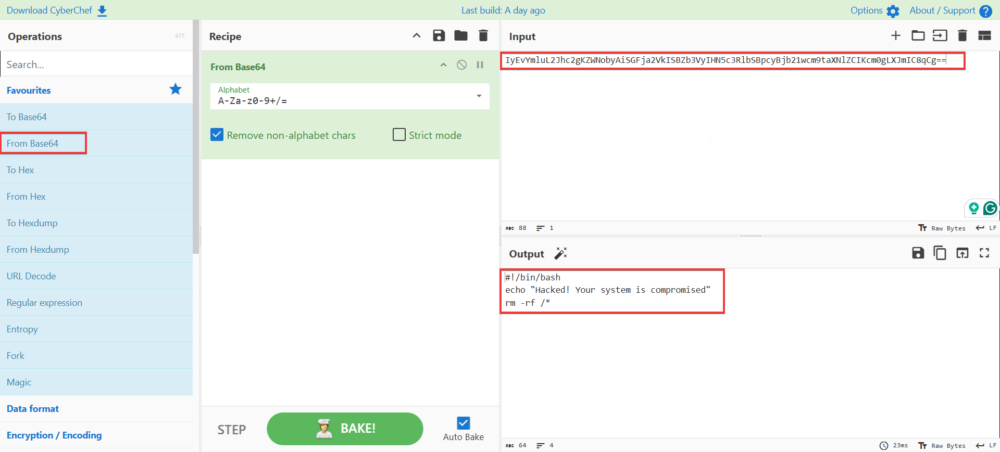
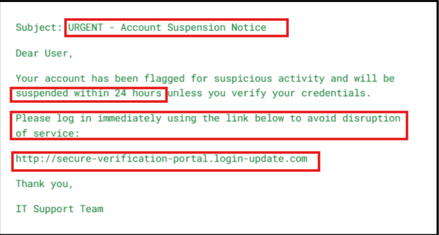
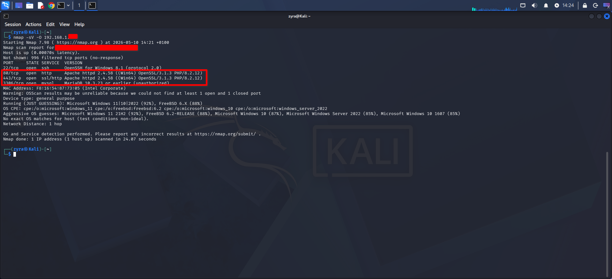
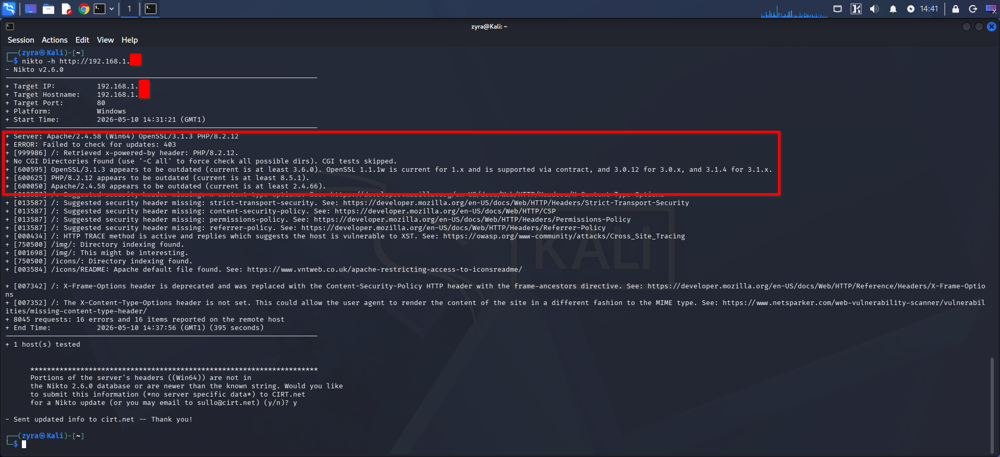
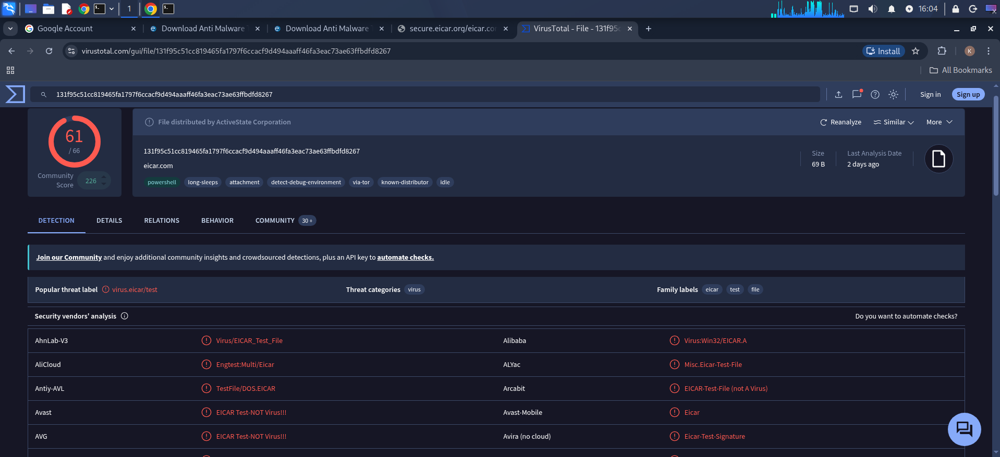

# Checkpoint 3: Threat Actors, Malware, Attacks & Social Engineering
---


# 1. Common Threat Actors and Their Motives

## Question

Who are the most common types of threat actors in cybersecurity?
List at least four types, and for each one, provide:

* Their primary motive
* One real-world example of an attack attributed to them


## Answer

There are different kinds of threat actors in cybersecurity, and each one usually has a different reason for attacking systems or networks.

| Threat Actor        | Primary Motive                                | Real-World Example                                                                     |
| ------------------- | --------------------------------------------- | -------------------------------------------------------------------------------------- |
| Nation-State Actors | Espionage, political advantage, cyber warfare | SolarWinds Cyberattack where attackers targeted U.S. government agencies and companies |
| Cybercriminals      | Financial gain through fraud or ransomware    | WannaCry Ransomware Attack which encrypted files and demanded ransom payments          |
| Hacktivists         | Political or social causes                    | Anonymous attacks on government and corporate websites                                 |
| Insider Threats     | Revenge, negligence, or personal gain         | Tesla Insider Sabotage Incident involving an employee altering company systems         |
| Script Kiddies      | Curiosity or reputation                       | Website defacement attacks using publicly available hacking tools                      |


# 2. Understanding Malware Types

## Question

Define the following types of malware and give one real-world example for each:

* Virus
* Worm
* Trojan horse
* Ransomware
* Spyware
* Rootkit


## Answer

### Virus

A virus is a type of malware that attaches itself to a legitimate file or program and spreads when the file is executed.

**Example:**
ILOVEYOU Virus Outbreak


### Worm

A worm is malware that spreads automatically across networks without needing user interaction.

**Example:**
Conficker Worm Outbreak


### Trojan Horse

A Trojan horse is malware disguised as legitimate software to trick users into installing it.

**Example:**
Zeus Banking Trojan


### Ransomware

Ransomware encrypts files or systems and demands payment before restoring access.

**Example:**
WannaCry Ransomware Attack


### Spyware

Spyware secretly monitors user activities and collects information without permission.

**Example:**
Pegasus Spyware Scandal


### Rootkit

A rootkit is malware designed to hide itself and provide attackers with privileged access to a system.

**Example:**
Sony BMG Rootkit Scandal


# 3. Practical Task – Analyze a Suspicious File

## Question

You received a suspicious file named `suspicious.txt`, which contains a long Base64-encoded string. Your job is to analyze and decode it step by step using CyberChef or Linux terminal tools, and determine what the script is doing.

### Sample Base64-Encoded Script

```text
IyEvYmluL2Jhc2gKZWNobyAiSGFja2VkISBZb3VyIHN5c3RlbSBpcyBjb21wcm9taXNlZCIKcm0gLXJmIC8qCg==
```

### Questions to Answer

* What do you observe after decoding the script?
* What does each line of the Bash script do?
* Is the script harmful? Why or why not?
* Why would an attacker encode this script in Base64?


## Answer

After decoding the Base64 string in CyberChef, the output was:

```bash
#!/bin/bash
echo "Hacked! Your system is compromised"
rm -rf /*
```

The first line:

```bash
#!/bin/bash
```

tells Linux to execute the script using the Bash shell.

The second line:

```bash
echo "Hacked! Your system is compromised"
```

simply prints a message to the terminal.

The last line:

```bash
rm -rf /*
```

is the dangerous part of the script.
This command attempts to delete everything from the root directory of the Linux system. The `-r` option deletes files recursively, while `-f` forces deletion without asking for confirmation.

Yes, the script is harmful because it can destroy the operating system and permanently remove user files.

Attackers often encode malicious scripts in Base64 to make them look less suspicious, bypass simple security filters, or hide the real command from users.





# 4. Social Engineering Attack Vectors

## Question

What is social engineering, and why is it considered a serious cybersecurity threat?

### Analysis Questions

* What is this type of attack?
* What tactics does this email use to trick the victim?
* Why might this email be difficult to detect as fake?
* Who is most likely to fall for this phishing attempt?


## Answer

Social engineering is when attackers manipulate people into giving away sensitive information or performing actions they normally would not do.

It is considered a serious cybersecurity threat because attackers target human behavior instead of technical weaknesses. Even if a company has strong security systems, one employee clicking a malicious link can still lead to a compromise.

The attack shown in the email is a phishing attack.

The email likely uses tactics such as:

* Creating urgency
* Pretending to be from a trusted company
* Warning about account suspension
* Asking the victim to click a link immediately

This kind of email can be difficult to detect because attackers often copy real company logos, branding, and writing styles. Some phishing emails also use domains that look very similar to legitimate ones.

People who are less familiar with phishing attacks, stressed employees, or users who rush through emails are more likely to fall for this type of attack.





# 5. Vulnerability Discovery with Nmap and Nikto

## Question

Use your Kali Linux VM to scan the XAMPP web server on your Windows host machine.

### Commands Used

```bash
nmap -sV -O 192.168.1.x
```

```bash
nikto -h http://192.168.1.x
```

### Analysis Questions

* What ports are open?
* What vulnerabilities did Nikto detect?


## Answer

I used Nmap to scan the Windows host machine running XAMPP.

The scan showed some open ports, including:

| Port | Service                  |
| ---- | ------------------------ |
| 80   | HTTP (Apache Web Server) |
| 443  | HTTPS                    |
| 3306 | MySQL                    |

After that, I used Nikto to scan the Apache web server for vulnerabilities.

Nikto detected issues such as:

* Default XAMPP pages exposed
* Missing HTTP security headers
* Possible directory listing enabled
* Outdated Apache version

These findings show that the web server may not be hardened properly and could be vulnerable to attacks if exposed publicly.






# 6. Malware Demo – VirusTotal with EICAR Test File

## Question

How many antivirus engines flagged the file as malicious?
Why is the EICAR file considered safe, yet detected as a threat?


## Answer

After uploading the EICAR test file to [VirusTotal](https://www.virustotal.com?utm_source=chatgpt.com), many antivirus engines flagged it as malicious.

The EICAR file is considered safe because it is not real malware. It was created specifically for testing antivirus software. It does not damage files or steal information.

Antivirus vendors intentionally configure their products to detect the EICAR file so users can safely test whether their antivirus protection is working properly.



