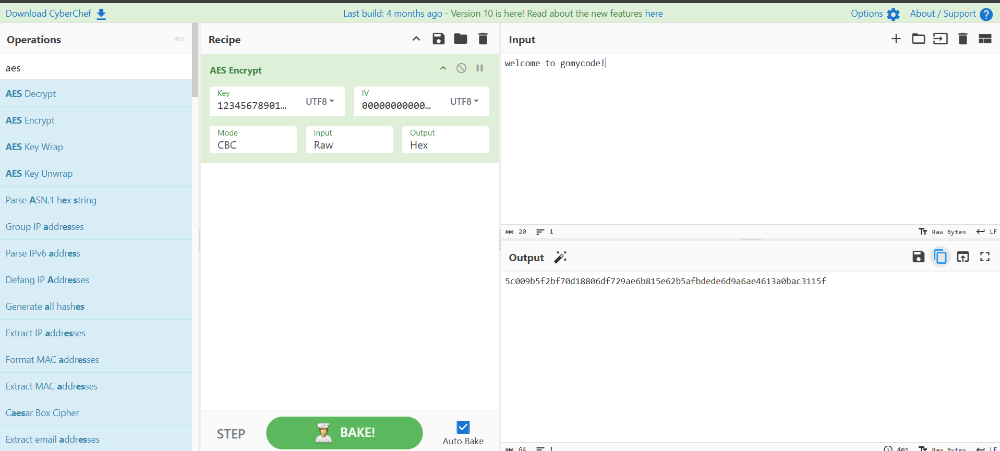
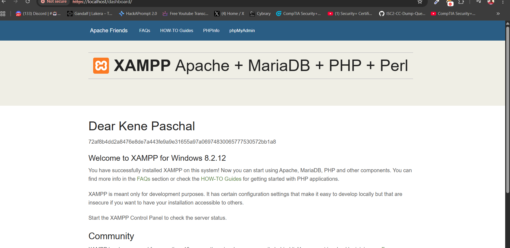
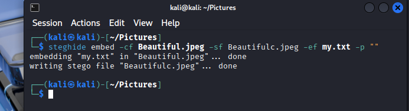
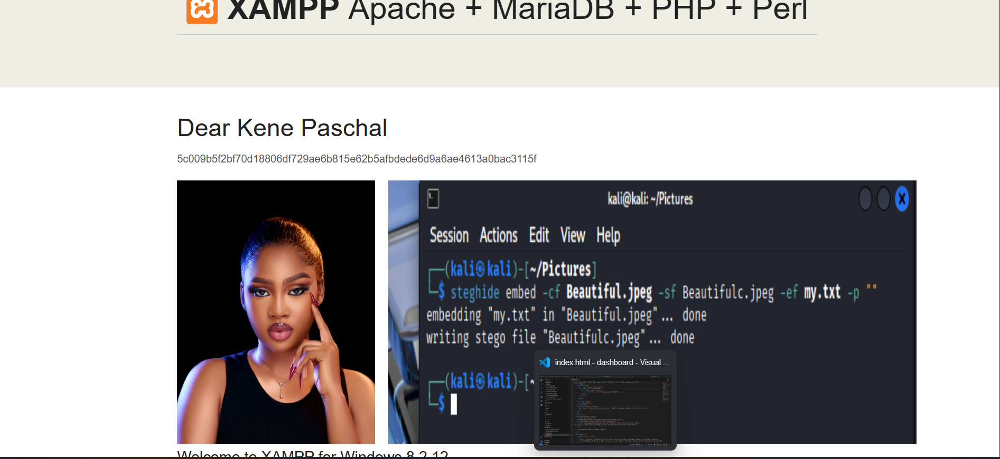

# Cybersecurity Lab Project – Complete Documentation (Questions 1–7)

This document contains all tasks from the cybersecurity practical, including access control strategies, CIA and AAA principles, encryption concepts, CyberChef usage, steganography, Steghide operations, and serving hidden files using XAMPP.

---

# 1. Securing a Web Application – Access Control Strategies

To protect a web application hosted on-premises, we use different types of controls.  
Each control can be **preventive**, **detective**, or **corrective**.

## **1. Managerial Controls**
These controls involve policies, rules, and decision-making from management.

| Control | Description | Type |
|--------|-------------|------|
| Security Policy | Defines how users should behave and how systems must be protected | Preventive |
| Risk Assessment | Identifies risks that could affect the application | Preventive |
| Incident Response Plan | Steps to follow when a security incident happens | Corrective |

---

## **2. Operational Controls**
These are day-to-day security activities performed by people.

| Control | Description | Type |
|--------|-------------|------|
| Security Awareness Training | Teaches staff how to stay safe from cyber threats | Preventive |
| Log Monitoring | Checking logs for suspicious activities | Detective |
| Backup Procedures | Regular backups to restore data | Corrective |

---

## **3. Technical Controls**
These involve the actual technology used to secure the system.

| Control | Description | Type |
|--------|-------------|------|
| Firewalls | Block unauthorized access to the server | Preventive |
| Intrusion Detection System (IDS) | Detects abnormal activities | Detective |
| Antivirus/Antimalware | Removes malicious files | Corrective |

---

## **4. Physical Controls**
These protect the physical hardware and environment.

| Control | Description | Type |
|--------|-------------|------|
| Door Locks | Prevent unauthorized physical access | Preventive |
| CCTV Cameras | Record activities for review | Detective |
| Fire Extinguishers | Reduce physical damage | Corrective |

---

# 2. Security Principles – CIA Triad and AAA

## **The CIA Triad**

### **1. Confidentiality**
Ensures that only authorized users can access information.  
**Example:** Using a password to open your email account.

### **2. Integrity**
Ensures that information is not changed or tampered with.  
**Example:** A bank system must prevent unauthorized modification of transaction amounts.

### **3. Availability**
Ensures that systems and data are always accessible when needed.  
**Example:** A website using backup generators so it remains online even during power outage.

---

## **AAA Security Model**

### **1. Authentication**
Verifies who a user is.  
**Example:** Logging in with a username and password.

### **2. Authorization**
Decides what the authenticated user is allowed to do.  
**Example:** A student can view grades but cannot edit school database records.

### **3. Accounting**
Tracks what users do on the system.  
**Example:** Logging all user activities for auditing.

---

# 3. Data Confidentiality – Encryption Types

## **Symmetric Encryption**
- Uses **one key** for both encryption and decryption.
- Key must be shared securely.
- Faster and good for encrypting large amounts of data.

**Example Algorithm:**  
- AES (Advanced Encryption Standard)

**Used When:**  
- Disk encryption  
- Encrypting files  
- VPN sessions  

---

## **Asymmetric Encryption**
- Uses **two keys**:  
  - A **public key** (shared with everyone)  
  - A **private key** (kept secret)
- More secure for key exchange but slower.

**Example Algorithm:**  
- RSA

**Used When:**  
- SSL/TLS (HTTPS websites)  
- Digital signatures  
- Secure key exchange  

---

# 4. Practical Encryption with CyberChef

### Steps I Followed

1. Opened CyberChef in the browser.
2. Typed a short message (example: *“wellcome to gomycode!”*).
3. Selected **AES Encrypt**.
4. Chose the key:  1234567890123456
5. iv: 0000000000000000
6. CyberChef generated an encrypted output.

**Encrypted Text:**
5c009b5f2bf70d18806df729ae6b815e62b5afbdede6d9a6ae4613a0bac3115f

6. Opened my `index.html` file in XAMPP’s *htdocs* folder.
7. Inserted my full name and the encrypted text.
8. Opened the page in the browser via:

[]http://localhost

### 📌 Screenshot (Insert below)

---

# 5. What Is Steganography?

### **Definition**
Steganography is the process of **hiding secret information inside another file** (image, audio, video) so that nobody knows the secret exists.

### **How It Differs from Encryption**
- **Encryption** scrambles data so it cannot be read.  
- **Steganography** hides the data itself inside another medium.

### **Example Uses**

**Attackers:**  
- Hide malware instructions inside a normal-looking image.

**Defenders:**  
- Hide sensitive information inside images for safe transport.

---

# 6. Hide a Secret Using Steghide (Kali Linux)

### Step-by-Step Process

#### 1. Check if Steghide is installed

steghide is installed  

#### 2. Create a secret message
echo "gomycode" > my.txt

#### 3. Choose an image  
Example: `Beautiful.jpeg`

#### 4. Embed the secret into the image
steghide embed -cf Beautiful.jpeg -sf beautifulc.jpeg -ef my.txt -p ""

#### 5. Extract the hidden message

steghide extract -sf Beautifulc.jpeg

#### 📌 Terminal Screenshot (Insert below)

---

# 7. Serve the Steganographic Image on XAMPP

